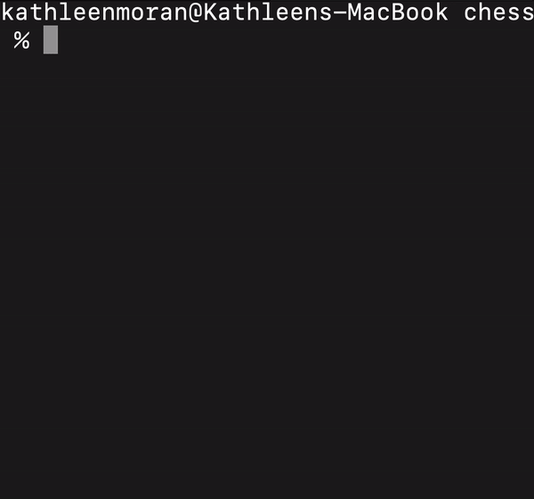

# Chess

A fully functional chess game that can be played with two players in the terminal.

Play online on [Replit](https://replit.com/@kathleenmoran10/chess#.replit).

## Demo


This demo shows a game that culminates in the [fool's mate](https://en.wikipedia.org/wiki/Fool%27s_mate#:~:text=In%20chess%2C%20the%20fool's%20mate,second%20move%20with%20the%20queen.), which is the checkmate delivered after the fewest possible moves from the game's starting position.

## Features

* Game saving and loading
* Piece selection and move highlighting
* Declares [checkmates](https://www.chess.com/terms/checkmate-chess) and [stalemates](https://www.chess.com/terms/stalemate-chess) when present
* Prevents users from making [illegal moves](https://chessdelta.com/illegal-moves-in-chess/)
* Handles special moves such as [castling](https://www.chess.com/article/view/how-to-castle-in-chess) and [en passant](https://www.chess.com/terms/en-passant)
* Allows users to propose and agree to draws
* Tested with RSpec

## How to Use

To play online, go [here](https://replit.com/@kathleenmoran10/chess#.replit).

To play locally, you must have [Ruby installed](https://www.ruby-lang.org/en/downloads/). This program was written in Ruby 3.1.

If you have Ruby installed, clone this repository:
```
$ git clone git@github.com:kathleenmoran/chess.git
```

Navigate to the top level folder and run `ruby lib/main.rb`. 

To run the tests you must have [RSpec installed](http://rspec.info/). These tests were written using RSpec 3.11.

Execute the tests by typing `rspec`.

## Style Guide

Written with the community [Ruby style guide](https://rubystyle.guide/). 

## Future Improvements

* Separate move logic in `Board` class into individual classes
* Add option to play against the computer
* Allow users to play a game by uploading a text file containing [FEN](https://www.chess.com/terms/fen-chess)
* Enforce the [fifty-move rule](https://en.wikipedia.org/wiki/Fifty-move_rule)
* Add integration tests

## Gratitudes

This project is based off of an assignment from [The Odin Project](https://www.theodinproject.com/lessons/ruby-ruby-final-project). Inspiration for the layout of this README was drawn from [ChargrilledChook's READMEs](https://github.com/ChargrilledChook).
